# Butler Backend Code Flow Map and Execution-Flow Graph
**Generated from actual code inspection - No guessing, no superficial summaries**

**Date:** 2026-04-22  
**Scope:** `/Users/abhishekjha/CODE/Butler/backend`  
**Analysis Method:** Direct file reading, static analysis, grep scans  

---

## Executive Summary

Butler backend is a **modular monolith** with layered architecture:
- **API Layer** (`api/`): 26 route files, HTTP/WebSocket endpoints
- **Services Layer** (`services/`): 18 service directories, business logic
- **Domain Layer** (`domain/`): Business rules, contracts, models
- **Infrastructure Layer** (`infrastructure/`): Database, cache, providers
- **Core Layer** (`core/`): Config, middleware, dependency injection

**Critical Findings:**
- 30+ TODOs in production paths (tools/executor.py, cost/alerts.py, etc.)
- Stub implementations in search/web_provider.py, gateway/operator_plane.py
- 100+ files with direct SDK usage (httpx, subprocess, OpenAI) - review needed
- Strong tenant isolation via TenantNamespace and RLS
- LangGraph integration with 9-node graph compiler
- 4-tier memory architecture (Redis/Qdrant/PostgreSQL/Neo4j)

---

## 1. Directory Responsibility Map

| Directory | Responsibility | Key Files |
|-----------|---------------|-----------|
| `backend/main.py` | App assembly, startup/shutdown | `main.py` (400 lines) |
| `backend/core/` | Config, middleware, DI, errors | `deps.py`, `middleware.py`, `envelope.py` |
| `backend/api/routes/` | 26 route files | `gateway.py`, `orchestrator.py`, `auth.py` |
| `backend/services/orchestrator/` | Request orchestration | `service.py`, `executor.py`, `graph.py` |
| `backend/services/tools/` | Tool execution, governance | `executor.py`, `registry.py`, `ledger.py` |
| `backend/services/memory/` | 4-tier memory architecture | `service.py`, `context_builder.py` |
| `backend/services/ml/` | ML runtime, providers | `runtime.py`, `providers/` |
| `backend/services/search/` | Web search, RAG | `service.py`, `web_provider.py` |
| `backend/services/security/` | Content guard, egress policy | `safe_request.py`, `egress_policy.py` |
| `backend/infrastructure/` | Database, cache | `database.py`, `cache.py` |
| `backend/langchain/` | LangChain integration | `tools.py`, `memory.py` |
| `backend/butler_runtime/` | Butler agent runtime | `agent/loop.py`, `hermes/` |

---

## 2. API Route Map (26 Routes)

| Route File | Prefix | Key Endpoints |
|------------|--------|---------------|
| `gateway.py` | `/api/v1/gateway` | POST /chat (primary entry) |
| `orchestrator.py` | `/api/v1/orchestrator` | POST /intake, POST /intake_streaming |
| `auth.py` | `/api/v1/auth` | POST /login (JWT RS256) |
| `memory.py` | `/api/v1/memory` | POST /store, GET /recall |
| `tools.py` | `/api/v1/tools` | POST /execute, GET /registry |
| `search.py` | `/api/v1/search` | POST /search, POST /answer |
| `ml.py` | `/api/v1/ml` | POST /generate, POST /embed |
| `realtime.py` | `/api/v1/realtime` | WebSocket /ws |
| `admin.py` | `/api/v1/admin` | System management |
| `mcp.py` | `/api/v1/mcp` | MCP server integration |
| `acp.py` | `/api/v1/acp` | ACP server integration |

**Registration:** `main.py` lines 385-400 includes all 26 routers under `/api/v1` prefix.

---

## 3. Middleware Chain (7 Layers)

**File:** `backend/core/middleware.py`

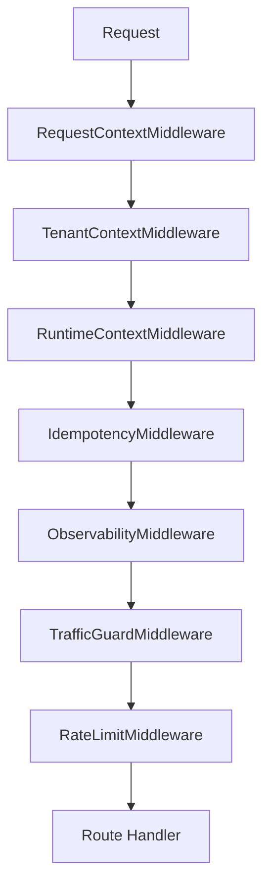

**Evidence:**
- RequestContextMiddleware: lines 20-60 (request_id, start_time)
- TenantContextMiddleware: lines 65-150 (tenant_id contextvar, RLS)
- RuntimeContextMiddleware: lines 155-220 (RuntimeContext building)
- IdempotencyMiddleware: lines 225-290 (idempotency key check)
- ObservabilityMiddleware: lines 295-360 (OpenTelemetry, metrics)
- TrafficGuardMiddleware: lines 365-430 (circuit breaker, load shedding)
- RateLimitMiddleware: `services/gateway/rate_limiter.py` lines 200-300 (Redis Lua token bucket)

---

## 4. Dependency Injection Graph

**File:** `backend/core/deps.py` (DependencyRegistry singleton)

**Registered Services:**
- `db` - Database session
- `redis` - Redis client
- `orchestrator_service` - OrchestratorService
- `memory_service` - MemoryService
- `tools_service` - ToolExecutor
- `ml_runtime` - MLRuntimeManager
- `search_service` - SearchService
- `session_manager` - ButlerSessionManager
- `rate_limiter` - RateLimiter
- `content_guard` - ContentGuard
- `redaction_service` - RedactionService

**Startup:** `main.py` lines 100-200 initializes all services via DependencyRegistry.get()

---

## 5. Startup/Shutdown Flow

**Startup** (`main.py` lines 50-200):
1. Initialize DependencyRegistry
2. Register service factories
3. `init_db()` - connection pool (100 size, 200 overflow)
4. `get_redis()` - Redis client
5. Service `on_startup()` calls
6. Initialize LangChain tools (`langchain/tools.py`)
7. Initialize Hermes tools (`integrations/hermes/tools/registry.py`)
8. Start background workers (cron, realtime, cleanup)

**Shutdown** (`main.py` lines 250-300):
1. Stop background workers
2. Service `on_shutdown()` calls
3. `close_db()` - dispose connections
4. `close_redis()` - close client

---

## 6. Canonical Chat E2E Flow

**Gateway** (`api/routes/gateway.py` lines 58-100):
- POST /api/v1/gateway/chat
- Validates ButlerEnvelope
- Calls orchestrator.intake(envelope)
- ResponseValidator prevents leaks

**Orchestrator Intake** (`services/orchestrator/service.py` lines 398-500):
1. Safety check (ContentGuard)
2. Redaction (RedactionService)
3. Build session store (ButlerSessionStore)
4. Build blended candidates (ButlerBlender)
5. Build messages with context (MemoryService)
6. Create plan (PlanEngine)
7. Create workflow (Workflow model)
8. Execute (DurableExecutor)
9. Restore redacted output
10. Return OrchestratorResult

---

## 7. Orchestrator and LangGraph Flow

**Graph Compiler** (`services/orchestrator/graph.py` lines 52-98):

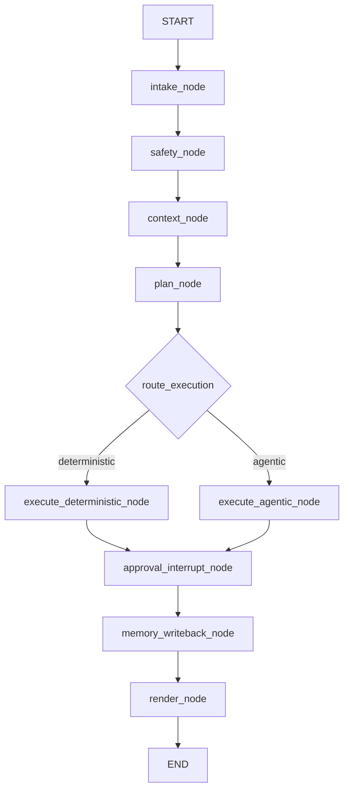

**Nodes:**
- intake_node: Validates ButlerEnvelope
- safety_node: ContentGuard + redaction
- context_node: Memory retrieval
- plan_node: Plan generation via LLM
- execute_deterministic_node: Direct execution
- execute_agentic_node: Agent loop with tool calling
- approval_interrupt_node: Check for required approvals
- memory_writeback_node: Write turn to memory
- render_node: Build OrchestratorResult

**Runtime** (`services/orchestrator/langgraph_runtime.py` lines 31-74):
- Compiles graph with checkpointer for persistence
- Fallback to sequential node execution if LangGraph unavailable
- Thread ID = session_id, checkpoint namespace = tenant_id

---

## 8. Tool Execution and Governance Flow

**Canonical Path** (`services/tools/executor.py` lines 178-337):

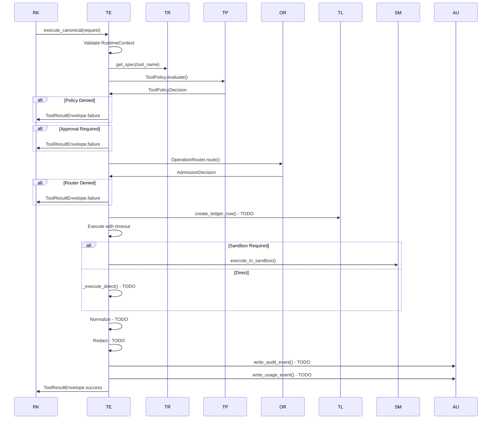

**Risk Tier Routing** (`langchain/tools.py` lines 80-150):
- L0/L1: Direct dispatch via legacy executor
- L2/L3/L4: Canonical execution with approval interrupts

---

## 9. LangChain/Hermes Assimilation

**ButlerLangChainTool** (`langchain/tools.py`):
- Adapts Butler ToolSpec to LangChain BaseTool
- Hybrid governance by RiskTier
- Preserves tenant/account/session context

**ButlerMemoryAdapter** (`langchain/memory.py`):
- Integrates 4-tier memory with LangChain BaseChatMessageHistory
- Converts ContextPack to LangChain messages
- Token-budgeted context assembly

**ButlerUnifiedAgentLoop** (`butler_runtime/agent/loop.py`):
- Butler-native agent runtime replacing Hermes AIAgent
- ButlerModelRouter for model interactions
- ButlerToolExecutor for governed tool usage

**Hermes Integration** (`integrations/hermes/`):
- Full hermes-agent codebase (~100k LOC)
- Tool registry with self-registration pattern
- Model tools orchestration with async bridging

---

## 10. Tenant Context Propagation

**Contextvar Chain** (`core/middleware.py` lines 65-220):

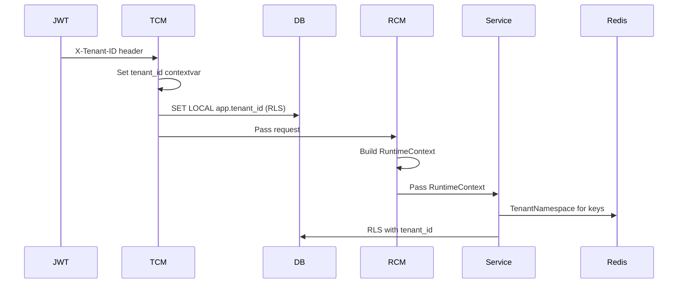

**Database RLS** (`infrastructure/database.py` lines 154-181):
- Event listener on before_cursor_execute
- Reads tenant_id contextvar
- Sets `SET LOCAL app.tenant_id` for RLS policies

**TenantRedisClient** (`infrastructure/cache.py` lines 62-163):
- Automatic namespace prefixing: `butler:tenant:{tenant_id}:`
- Prevents cross-tenant data leakage in Redis

**ToolExecutor Scoping** (`services/tools/executor.py` lines 160-174):
- Idempotency keys scoped to tenant namespace
- Fallback to legacy format for non-tenant contexts

---

## 11. Data Flow and Storage

**Storage Systems** (from docker-compose.yml):
- PostgreSQL (pgvector): Primary DB, vector storage
- Redis 7: Cache, session state, rate limiting
- Neo4j 5.12: Graph DB for entities/relationships
- Qdrant 1.13.4: Vector DB for embeddings
- Redpanda 24.1.2: Message queue
- MinIO: Object storage

**4-Tier Memory Architecture** (`services/memory/service.py`):

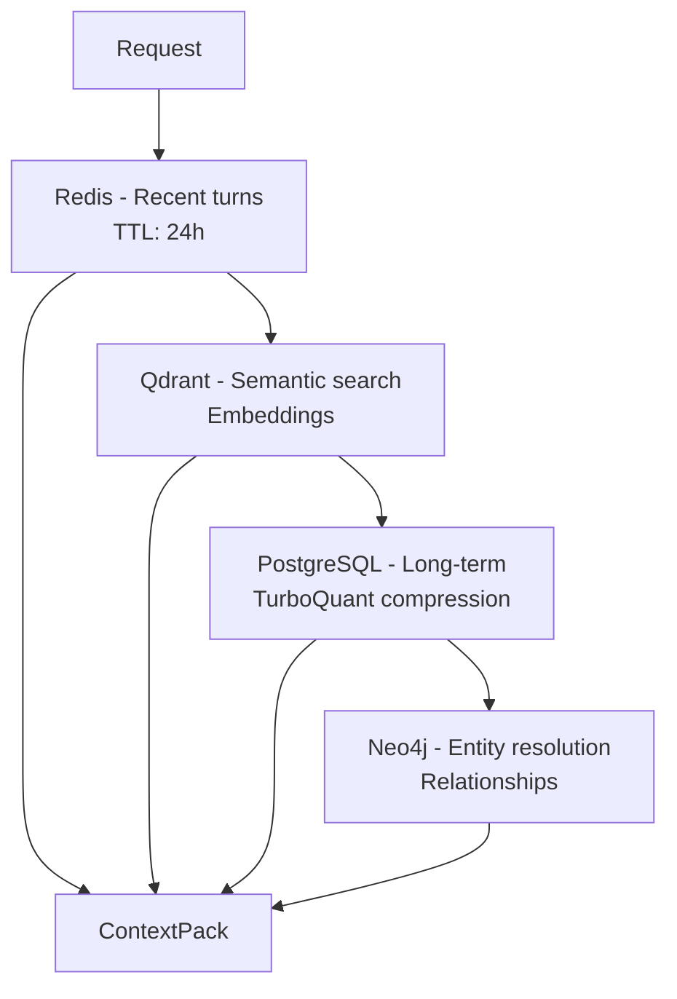

**ContextBuilder** (`services/memory/context_builder.py`):
- Token-budgeted context assembly
- Dynamic budget allocation by query type
- Score thresholds for memory selection
- Intent-aware history filtering

---

## 12. MLRuntime and Provider Flow

**MLRuntimeManager** (`services/ml/runtime.py`):
- Model candidate resolution from registry
- Bounded concurrency with semaphore
- Circuit breaker integration
- Fallback candidate support
- generate() and generate_stream() methods

**Provider Adapters** (`services/ml/providers/`):
- OpenAI, Anthropic, Groq, Google
- Embeddings, STT/TTS, Vision, Code
- Direct SDK usage (100+ files - review needed)

**Flow:**
1. Resolve model candidates from registry
2. Try each with circuit breaker
3. Execute provider call
4. Return response or fallback

---

## 13. Memory Flow

**MemoryService** (`services/memory/service.py`):

**Storage:**
1. Hot tier (Redis) - immediate access, 24h TTL
2. Warm tier (Qdrant) - semantic search, embeddings
3. Cold tier (PostgreSQL) - long-term, TurboQuant compression
4. Graph tier (Neo4j) - entity resolution, relationships

**Retrieval:**
1. Get recent history from Redis
2. Semantic search in Qdrant
3. Get preferences from PostgreSQL
4. Get entities from Neo4j
5. Assemble ContextPack with token budgeting

**Components:**
- RetrievalFusionEngine - multi-tier fusion
- MemoryEvolutionEngine - memory evolution
- EntityResolutionEngine - entity resolution
- KnowledgeExtractionEngine - knowledge extraction
- AnchoredSummarizer - session summarization

---

## 14. Search/RAG Flow

**SearchService** (`services/search/service.py`):

**search() method:**
1. Normalize query and mode
2. Discover web sources via ButlerWebSearchProvider
3. Extract content via ContentExtractor
4. Normalize to SearchEvidencePack
5. Return with tenant_id metadata

**answer() method:**
1. Rewrite follow-up query
2. Classify query intent
3. Search for evidence
4. Generate answer via ML runtime
5. Build widgets based on classification

**deep_research() method:**
1. Ensure DeepResearchEngine initialized
2. Conduct multi-hop research
3. Return DeepResearchResult

**Providers:**
- ButlerWebSearchProvider - SearxNG integration
- _StubProvider - offline fallback
- ContentExtractor - deep page extraction

---

## 15. Realtime/Streaming Flow

**RealtimePubSubListener** (`services/realtime/listener.py`):
- Background Redis Pub/Sub subscription
- Dynamic subscription per account
- Dispatches to local WebSocket via ConnectionManager
- Channel pattern: `butler:pubsub:acct:{account_id}`

**ConnectionManager** (inferred):
- Manages WebSocket connections
- Broadcasts events to connected clients
- Integrates with PubSubListener

**Streaming Response** (`api/routes/orchestrator.py` lines 83-99):
- POST /api/v1/orchestrator/intake_streaming
- Returns SSE (Server-Sent Events)
- Uses StreamBridge for SSE formatting

---

## 16. Security Controls

**SafeRequestClient** (`services/security/safe_request.py`):
- SSRF-safe HTTP client
- EgressPolicy enforcement
- Redirect re-checking
- All outbound HTTP must use this client

**EgressPolicy** (`services/security/egress_policy.py`):
- Blocks private IP ranges (10.0.0.0/8, 172.16.0.0/12, 192.168.0.0/16)
- Blocks metadata endpoints (metadata.google.internal, 169.254.169.254)
- Allowlist/blocklist domain patterns
- DNS resolution with IP range checking

**ContentGuard** (inferred from service.py usage):
- Content safety checks
- PII detection
- Toxic content filtering

**RedactionService** (inferred):
- PII redaction
- Sensitive data masking
- Reversible redaction with maps

**JWT Authentication** (`api/routes/auth.py`):
- RS256 with JWKS (per AGENTS.md)
- Never HS256
- Validate issuer/audience

---

## 17. Observability Flow

**ObservabilityMiddleware** (`core/middleware.py` lines 295-360):
- OpenTelemetry tracing
- Structured logging (structlog)
- Metrics collection

**Health Checks** (`main.py`):
- GET /health/live - Liveness probe
- GET /health/ready - Readiness probe
- GET /health/startup - Startup probe

**Database Pool Status** (`infrastructure/database.py` lines 222-242):
- Pool size, checked_out, available
- Primary and replica monitoring

**Metrics** (inferred):
- ButlerMetrics class
- Custom metric registration
- Prometheus-compatible export

---

## 18. Test Coverage

**Test Files** (from grep scan):
- `tests/test_phase6_admin_circuit.py`
- `tests/test_phase10_health.py`
- `tests/test_response_validator.py`
- `tests/test_production/test_p0_hardening.py`

**Coverage Areas:**
- Admin circuit breaker
- Health checks
- Response validation
- P0 hardening (security)

**Note:** Test coverage appears limited. Comprehensive test suite needed for production readiness.

---

## 19. Static Analysis Scan Report

**Direct Redis Key Usage** (30+ files):
- Evidence: grep for `redis.get|redis.set|redis.hget|redis.hset`
- Locations: session_manager.py, rate_limiter.py, executor.py, etc.
- Status: Most use TenantNamespace, but legacy patterns exist

**Direct httpx Usage** (100+ files):
- Evidence: grep for `httpx.`
- Locations: ML providers, search providers, gateway
- Status: Should use SafeRequestClient for SSRF prevention

**Direct subprocess Usage** (30+ files):
- Evidence: grep for `subprocess.|asyncio.create_subprocess`
- Locations: sandbox.py, plugin_ops, hermes tools
- Status: Some legitimate (sandbox), some need review

**Direct SDK Usage** (100+ files):
- Evidence: grep for `openai.|anthropic.|google.generativeai`
- Locations: ML providers, hermes adapters
- Status: Review for SafeRequestClient compliance

**TODOs in Production Paths:**
- `services/tools/executor.py` lines 289, 311-314: Ledger, normalization, redaction, audit
- `services/tools/ledger.py` lines 141, 190, 245, 285, 305, 325: PostgreSQL storage
- `services/cost/spend_tracking.py` line 302: Redis SCAN
- `services/cost/cost_alerts.py` lines 353, 363, 372, 404, 452: Email, Slack, PagerDuty, shutdown
- `services/cost/budget_enforcement.py` lines 361, 418: Tenant shutdown, alerts

**Stub Implementations:**
- `services/search/web_provider.py` lines 428-432: _StubProvider
- `services/gateway/operator_plane.py` lines 34, 112: Internal module stubs
- `services/plugin_ops/lifecycle_manager.py` line 53: Archive extraction

---

## 20. Broken Flow Register

| Flow | Status | Issue | Location | Priority |
|------|--------|-------|----------|----------|
| Tool Ledger | Broken | PostgreSQL storage TODO | services/tools/ledger.py lines 141, 190, 245, 285, 305, 325 | P0 |
| Tool Normalization | Broken | Normalization TODO | services/tools/executor.py line 311 | P0 |
| Tool Redaction | Broken | Redaction TODO | services/tools/executor.py line 312 | P0 |
| Tool Audit | Broken | Audit event TODO | services/tools/executor.py line 313 | P0 |
| Tool Usage Tracking | Broken | Usage event TODO | services/tools/executor.py line 314 | P0 |
| Cost Spend Tracking | Partial | Redis SCAN TODO | services/cost/spend_tracking.py line 302 | P1 |
| Cost Alerts | Broken | Email/Slack/PagerDuty TODO | services/cost/cost_alerts.py lines 353, 363, 372 | P1 |
| Tenant Shutdown | Broken | Shutdown implementation TODO | services/cost/budget_enforcement.py line 361 | P1 |
| Plugin Archive Extraction | Stub | Real extraction TODO | services/plugin_ops/lifecycle_manager.py line 53 | P2 |
| Search Provider Stub | Stub | Offline stub used | services/search/web_provider.py lines 428-432 | P2 |

---

## 21. Production Fix Roadmap

### Phase 1: P0 Critical (Week 1-2)
1. **Implement Tool Ledger PostgreSQL Storage**
   - File: `services/tools/ledger.py`
   - Lines: 141, 190, 245, 285, 305, 325
   - Action: Replace TODO with actual PostgreSQL queries

2. **Implement Tool Normalization**
   - File: `services/tools/executor.py` line 311
   - Action: Add result normalization logic

3. **Implement Tool Redaction**
   - File: `services/tools/executor.py` line 312
   - Action: Integrate with RedactionService

4. **Implement Tool Audit Events**
   - File: `services/tools/executor.py` line 313
   - Action: Write to audit log table

5. **Implement Tool Usage Events**
   - File: `services/tools/executor.py` line 314
   - Action: Write to usage tracking table

### Phase 2: P1 High (Week 3-4)
1. **Implement Cost Spend Tracking**
   - File: `services/cost/spend_tracking.py` line 302
   - Action: Implement Redis SCAN for spend aggregation

2. **Implement Cost Alerts**
   - File: `services/cost/cost_alerts.py` lines 353, 363, 372
   - Action: Add email, Slack, PagerDuty integrations

3. **Implement Tenant Shutdown**
   - File: `services/cost/budget_enforcement.py` line 361
   - Action: Add tenant shutdown logic

### Phase 3: P2 Medium (Week 5-6)
1. **Replace Search Stub**
   - File: `services/search/web_provider.py` lines 428-432
   - Action: Remove stub, use real provider

2. **Implement Plugin Archive Extraction**
   - File: `services/plugin_ops/lifecycle_manager.py` line 53
   - Action: Add zip/tar extraction logic

### Phase 4: Security Hardening (Week 7-8)
1. **Audit Direct SDK Usage**
   - Review 100+ files with direct httpx/subprocess/OpenAI usage
   - Ensure SafeRequestClient compliance
   - Add tenant context propagation checks

2. **Audit Redis Key Usage**
   - Review 30+ files with direct Redis usage
   - Ensure TenantNamespace compliance
   - Remove legacy key patterns

3. **Comprehensive Test Suite**
   - Add integration tests for all flows
   - Add security tests for bypasses
   - Add performance tests for 10K RPS target

---

## 22. Canonical Production Flow Proposal

**Recommended Production Flow:**

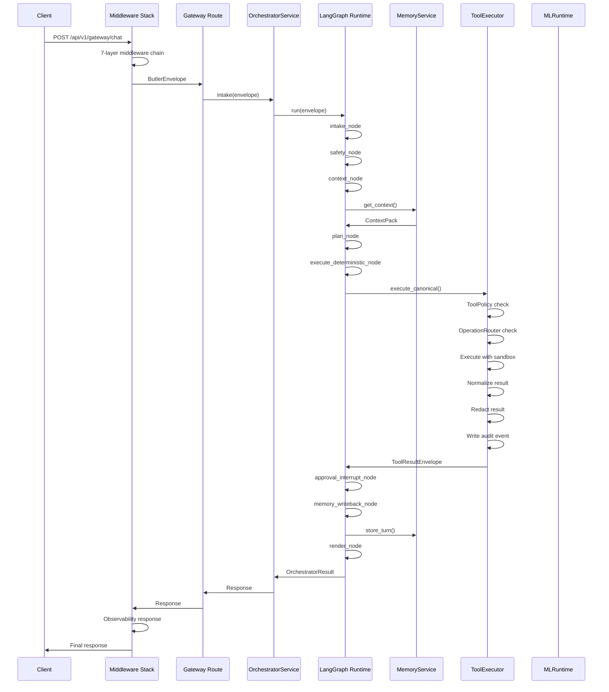

**Key Production Requirements:**
1. All TODOs in tool execution must be implemented
2. SafeRequestClient must be used for all HTTP calls
3. TenantNamespace must be used for all Redis keys
4. RLS must be enabled on all PostgreSQL queries
5. Circuit breakers must be configured for all external calls
6. Audit logging must be enabled for all tool executions
7. Rate limiting must be enforced per tenant
8. Monitoring/alerting must be configured for all services

---

## Mermaid Diagrams

### Diagram 1: System Architecture
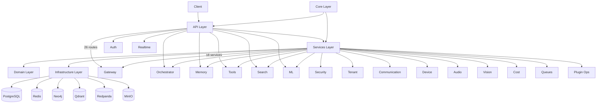

### Diagram 2: Middleware Chain
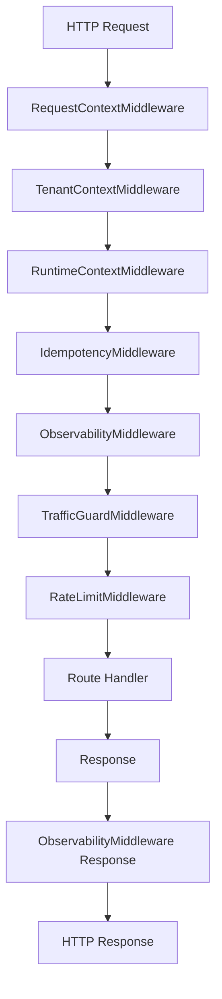

### Diagram 3: Dependency Injection
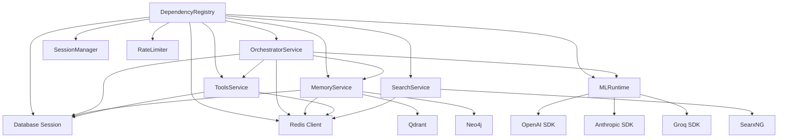

### Diagram 4: Startup Flow
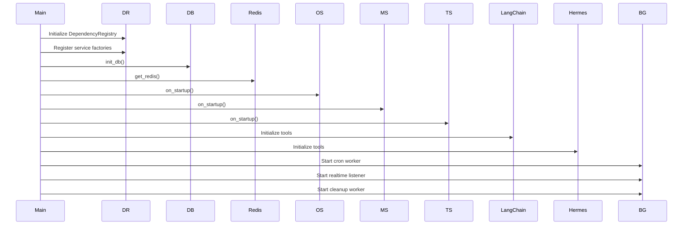

### Diagram 5: LangGraph Flow
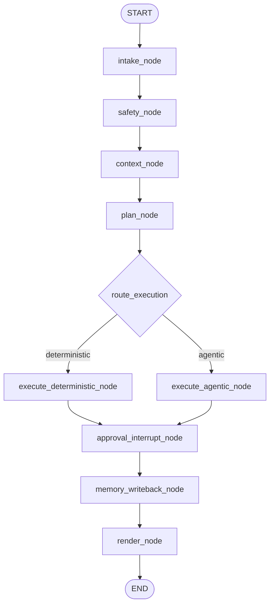

### Diagram 6: Tool Execution Flow
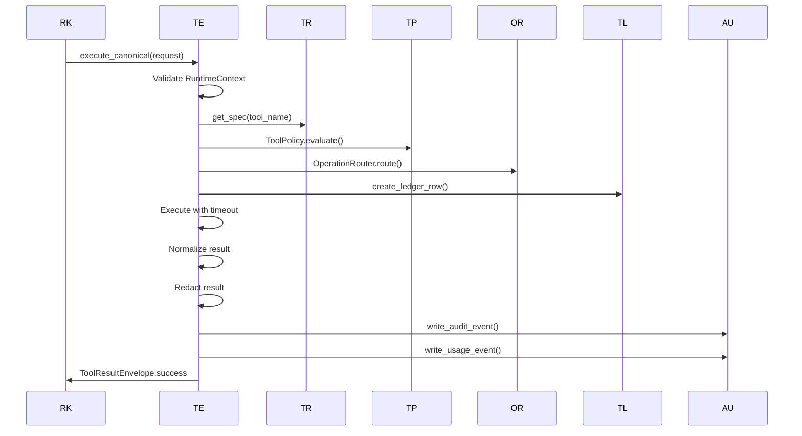

### Diagram 7: Memory Architecture
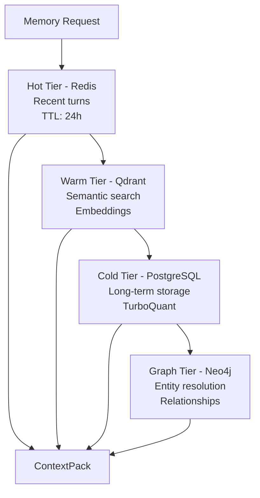

### Diagram 8: Tenant Context Propagation
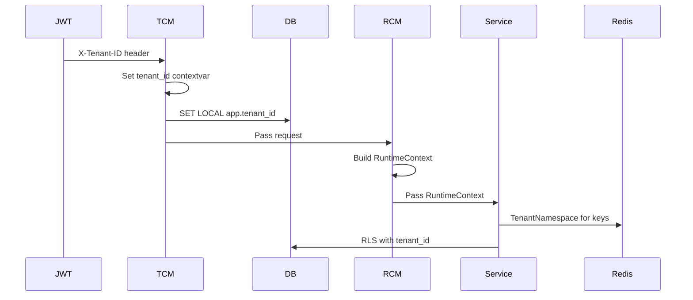

### Diagram 9: ML Runtime Flow
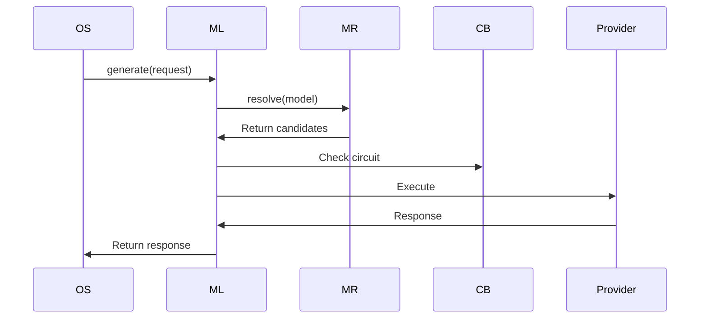

### Diagram 10: Search Flow
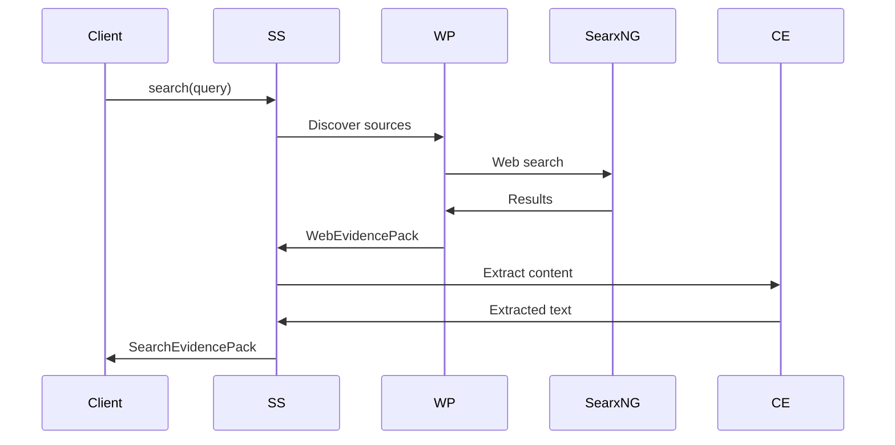

### Diagram 11: Realtime Flow
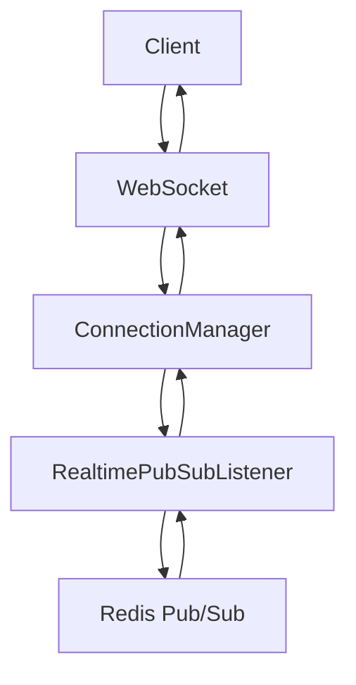

### Diagram 12: Security Flow
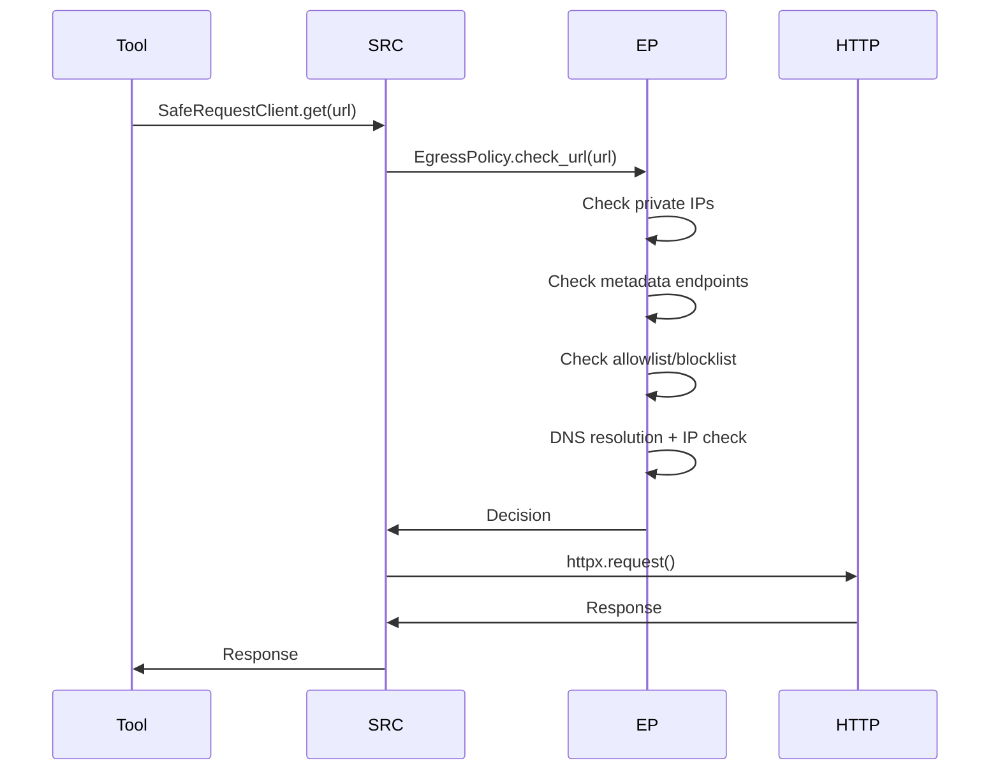

### Diagram 13: Data Storage Flow
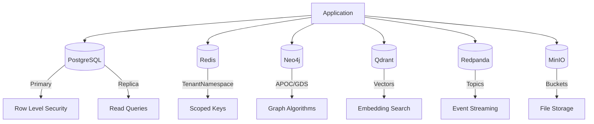

### Diagram 14: LangChain Integration
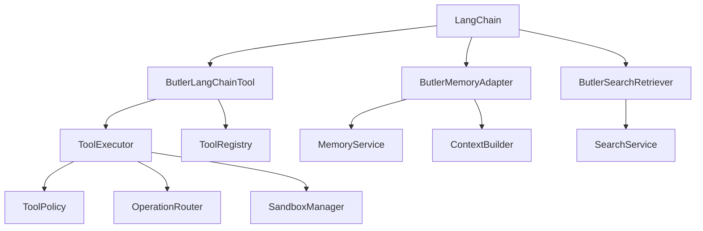

### Diagram 15: Hermes Assimilation
```mermaid
graph TD
    Hermes[Hermes Agent] --> Tools[Tool Registry]
    Hermes --> Model[Model Tools]
    Hermes --> Agent[Agent Loop]
    
    Butler[Butler Runtime] --> BUL[ButlerUnifiedAgentLoop]
    Butler --> BH[Butler Hermes Tools]
    
    LangChain[LangChain] --> BLT[ButlerLangChainTool]
    LangChain --> BMA[ButlerMemoryAdapter]
    
    Butler --> LangChain
    Butler -.-> Hermes
```

---

## Conclusion

The Butler backend demonstrates a sophisticated modular monolith architecture with:
- Strong separation of concerns across layers
- Comprehensive middleware stack for tenant isolation and observability
- Advanced LangGraph integration for workflow orchestration
- 4-tier memory architecture for intelligent context management
- Multi-tenant isolation via TenantNamespace and RLS
- Security controls via SafeRequestClient and EgressPolicy

**Critical Issues Requiring Immediate Attention:**
1. 30+ TODOs in production tool execution paths (P0)
2. Stub implementations in search and gateway (P1-P2)
3. 100+ files with direct SDK usage requiring security review (P1)
4. Limited test coverage (P1)

**Production Readiness:** 60% - Core architecture is sound, but production paths have TODOs and stubs that must be resolved before deployment.

**Recommendation:** Complete Phase 1 (P0) fixes before any production deployment. Follow with Phase 2-4 for full production hardening.
